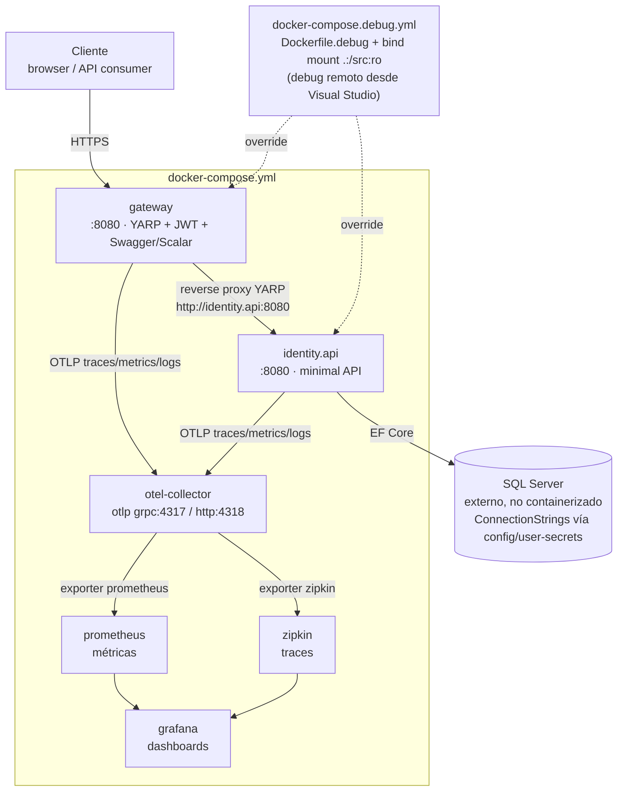

# NetErp

ERP construido como ejercicio de arquitectura de microservicios con .NET. Un
**Gateway** (YARP) enruta a **servicios** independientes, cada uno con Clean
Architecture (Api / Application / Core / Infrastructure), y comparten piezas
transversales a través del proyecto **Commons**.

## Estructura de la solución

```
src/
  Commons/            # librería compartida (no es un servicio)
  Gateway/            # API Gateway (YARP + JWT + OpenAPI aggregation)
  Gateway.Test/       # xUnit + NSubstitute para Gateway (ver seccion de Testing)
  services/
    identity/         # único servicio implementado end-to-end
      Identity.Api/            (endpoints minimal API, Program.cs, seguridad Kestrel)
      Identity.Application/    (CQRS: Commands/Queries/Handlers/Validators/Dto/Mappers)
      Identity.Core/           (entidades + interfaces de repositorio, sin dependencias externas)
      Identity.Infrastructure/ (EF Core SqlServer, repositorios)
      Identity.Test/           (xUnit + NSubstitute, un test por Handler/Validator/Repository)
    address/          # SCAFFOLD SIN IMPLEMENTAR — ver nota abajo
```

`NetErp.slnx` solo incluye Commons, Gateway, Gateway.Test y los proyectos de
`identity`. **`src/services/address/` está vacío**: el scaffold
(`Address.Api` con el `WeatherForecastController` por defecto,
`Address.Application`, `Address.Core`, `Address.Infrastructure`) fue
eliminado del árbol de trabajo y nunca estuvo agregado al `.slnx`. Si vas a
implementar Address, es un servicio nuevo desde cero (replicando la
estructura de `identity`), no hay plantilla que recuperar.

## Arquitectura

### Módulos y dependencias

```mermaid
graph LR
  subgraph Commons["Commons (transversal, sin ser un servicio)"]
    direction TB
    Mediator["Mediator<br/>ICommand/IQuery + Dispatcher"]
    EndPoints["EndPoints<br/>IEndpoint + MapEndpointsFromAssembly"]
    ExcHandlers["ExceptionHandlers<br/>Validation / Unhandled"]
    I18n["I18n<br/>ResxLocalizer"]
    Observability["Observability<br/>Serilog + OpenTelemetry SDK"]
    AppServices["AppServices<br/>DI: Application / Infrastructure / I18n"]
  end

  GwApi["Gateway<br/>YARP + JWT + Swagger/Scalar"]
  GwTest["Gateway.Test"]

  subgraph IdentitySvc["Identity (único servicio implementado end-to-end)"]
    direction TB
    IdApi["Identity.Api<br/>minimal API endpoints"]
    IdApp["Identity.Application<br/>Commands/Queries/Handlers/Validators"]
    IdCore["Identity.Core<br/>Entities + IUserRepository + Optional&lt;T&gt;<br/>(sin dependencias, ni a Commons)"]
    IdInfra["Identity.Infrastructure<br/>EF Core SqlServer + UserRepository"]
  end
  IdTest["Identity.Test"]

  GwApi -->|ProjectReference| Commons
  GwTest -->|ProjectReference| GwApi

  IdApi -->|ProjectReference| IdInfra
  IdInfra -->|ProjectReference| IdApp
  IdApp -->|ProjectReference| IdCore
  IdApp -->|ProjectReference| Commons
  IdTest -->|ProjectReference| IdApi
  IdTest -->|ProjectReference| IdInfra

  GwApi -.->|"HTTP proxy YARP<br/>/api/v1/auth/* + JWT"| IdApi
```



`Identity.Core` es la única capa sin ninguna referencia de proyecto (ni
siquiera a Commons) — ver la nota de `Optional<T>` más abajo sobre por qué se
mantiene así a propósito.

### Infraestructura (docker-compose)



Ambos servicios exportan **traces + metrics + logs** por OTLP al
`otel-collector` (nunca directo a Zipkin/Prometheus/Grafana, ver sección de
Observability más abajo); el collector reenvía traces a Zipkin y métricas a
Prometheus, y Grafana consume de ambos. No hay contenedor de SQL Server en
`docker-compose.yml`: `Identity.Api` espera `ConnectionStrings` por
configuración/user-secrets contra una instancia externa.

## Flujo de una request (patrón a replicar en servicios nuevos)

1. **Api/Endpoints**: clases `IEndpoint` (`Commons/EndPoints/IEndpoint.cs`) con
   un método estático `MapEndpoints`. Se descubren y registran automáticamente
   vía reflection con `app.MapEndpointsFromAssembly(assembly)` — no hay que
   registrar cada endpoint a mano en `Program.cs`.
2. El endpoint arma un `ICommand<TResponse>` o `IQuery<TResponse>`
   (`Commons/Mediator/`) y lo pasa a `IDispatcher.SendAsync(...)`.
3. **Mediator propio (no MediatR)**: `Dispatcher` (Commons/Mediator/Dispatcher.cs)
   resuelve el handler por reflection (con caché en `ConcurrentDictionary`) y
   lo invoca. `ICommandHandler<TCommand,TResponse>` / `IQueryHandler<TQuery,TResponse>`
   se auto-registran por assembly scanning en
   `RegistrationOfApplicationServices<TAssemblyMarker>.AddApplication` — no
   hay que registrarlos a mano.
4. **Decoradores automáticos** (vía Scrutor `TryDecorate`, mismo método
   anterior): cada handler queda envuelto por
   `Command/QueryValidationExceptionHandler` (corre los `IValidator<T>` de
   FluentValidation antes del handler y lanza `ValidationException` si falla)
   y `Command/QueryUnhandledExceptionHandler`. Un nuevo Command/Query solo
   necesita su `AbstractValidator<T>` en el mismo assembly para quedar
   validado — no hay que envolver nada manualmente.
5. `ValidationExceptionHandler` (Commons) traduce `ValidationException` /
   `BadHttpRequestException` a 400 vía `app.UseExceptionHandler()` +
   `AddProblemDetails()`.
6. Repositorios de Infrastructure se auto-registran por convención de nombre
   (`RegistrationOfInfrastructureServices<TAssemblyMarker>.RepositoryRegistry`:
   busca clases `*Repository` y las mapea a su interfaz `I*Repository`).

Al agregar un caso de uso nuevo: crear el Command/Query + Handler + (opcional)
Validator en `*.Application`; **no** tocar el registro de DI a mano salvo que
sea un servicio con nombre que no siga la convención `*Repository`/`I*`.

## Transversal (Commons)

- **Observability**: Serilog (consola + OTLP) + OpenTelemetry SDK (traces con
  `AlwaysOnSampler`, sin muestreo). Todo apunta al `otel-collector` de
  `docker-compose.yml`, nunca directo a Zipkin/Prometheus/Grafana.
  `builder.AddObservability(serviceName)` + `app.UseObservability()`.
- **I18n**: `Commons/I18n` — es-MX / en-US, resuelto por querystring
  `?culture=` o header `Accept-Language`. Mensajes en `.resx`
  (`GenericMessages` en Commons, `UserMessages` por servicio) leídos con
  `ResxLocalizer`, no con `IStringLocalizer` inyectado.
- **Kestrel hardening**: `AddKestrelHardening()` / `UseKestrelHardening()`,
  presente en Gateway e Identity.Api.

## Seguridad (JWT)

- Identity.Api emite el JWT (HMAC-SHA256, claims `sub`/`email`/`jti` + un
  claim `Role` por rol). El **Gateway** es quien valida el token
  (`Gateway/Security/JwtAuthenticationExtensions.cs`) y protege
  `/swagger` y Scalar con la policy `Swagger` (requiere claim de rol
  `SWAGGER`, que debe coincidir con el `NormalizedName` del rol en Identity).
- Gateway e Identity.Api **comparten el mismo `UserSecretsId`** en dev
  (`e247ba43-7d48-46cb-8a54-02978f226af8`) para compartir `Jwt:SigningKey` vía
  user-secrets — no hardcodear la signing key en `appsettings.json`.
- El Gateway permite el JWT también vía cookie (`netErp_swagger_token`) para
  navegación de swagger/scalar desde el navegador; clientes de API siguen
  recibiendo 401/403 normales (`OnChallenge`/`OnForbidden` distinguen por
  `Accept: text/html`).

## Convenciones de código observadas

- Indentación de **2 espacios**, `Nullable` + `ImplicitUsings` habilitados en
  todos los `.csproj`, target `net10.0`.
- Primary constructors (`class Foo(IDep dep) : IBar`) en handlers y
  repositorios.
- `.ConfigureAwait(false)` en todo `await` de librería/servicio (no en tests).
- DTOs de Application como `record`.
- Comentarios de código en **español**, explicando el *por qué* (decisiones
  de diseño), no el qué.
- Tests: xUnit + NSubstitute, un archivo de test por clase, nombres
  `Method_When<condición>_<resultado esperado>`.

## Testing

- **Identity.Test** (`src/services/identity/Identity.Test`) y **Gateway.Test**
  (`src/Gateway.Test`) son los dos proyectos de test, ambos xUnit + NSubstitute
  + `Microsoft.AspNetCore.Mvc.Testing`/`TestHost`. Naming: `<Proyecto>.Test`
  (no `<Proyecto>Test`), como el resto de la solución.
- Para que `WebApplicationFactory<Program>` funcione, cada `*.Api`/Gateway
  `Program.cs` termina con `public partial class Program { }` (top-level
  statements + WebApplicationFactory lo requiere). Si se reescribe un
  `Program.cs`, no borrar esa línea.
- Patrón de test de endpoints (`AuthenticationEndpointsTests`,
  `LoginEndpointsTests`): NO usar `WebApplicationFactory` completo para probar
  un solo `IEndpoint`; construir un `WebApplication.CreateBuilder()` +
  `UseTestServer()` a mano, mapear solo esa clase de endpoint y sustituir sus
  dependencias (`IDispatcher`, `IHttpClientFactory`) con NSubstitute o un
  `HttpMessageHandler` de prueba. Reservar `WebApplicationFactory<Program>`
  para los `ProgramTests` que verifican la composición completa (lectura de
  config, registro de servicios, endpoints mapeados).
- `HttpMessageHandler.SendAsync` es `protected`: NSubstitute no puede
  configurarlo directamente. `Gateway.Test/TestSupport/StubHttpMessageHandler.cs`
  es una subclase de prueba hecha a mano para ese caso puntual (usada para
  simular las respuestas de Identity.Api en `LoginEndpointsTests`); el resto
  de dependencias sustituibles siguen usando NSubstitute.
- Al construir un `WebApplicationBuilder` de prueba con
  `builder.Configuration.Sources.Clear()`, no usar el indexer
  (`builder.Configuration["Key"] = valor`) para inyectar valores después:
  `ConfigurationManager` lanza `InvalidOperationException` ("A configuration
  source is not registered") si no hay ninguna fuente registrada. Usar
  `builder.Configuration.AddInMemoryCollection(new Dictionary<string,string?> {...})`
  en su lugar (o no limpiar `Sources` si el indexer alcanza).
- `HstsMiddleware` (`UseKestrelHardening`) excluye explícitamente
  `localhost`/`127.0.0.1`/`::1`: para probar que agrega el header
  `Strict-Transport-Security` con `TestServer`, el `HttpClient.BaseAddress`
  debe usar un host distinto (p.ej. `https://gateway.tests.local/`), nunca
  `localhost`.
- Los endpoints `/login`, `/logout` y la protección de `/swagger` (Gateway)
  solo se mapean cuando `app.Environment.IsDevelopment()` es verdadero (ver
  `Gateway/Program.cs`). Los `ProgramTests` de Gateway verifican explícitamente
  que en `Production` esos endpoints NO existen — es una prueba de seguridad,
  no un detalle a "corregir" si falla por accidente.

## Cosas a tener presentes / deuda conocida

- `LoginHandler` está modelado como `IQueryHandler` (una consulta) pero
  también escribe (`CreateLogginAttemptAsync`, `IssueRefreshTokenAsync`).
  Es una decisión ya tomada en el proyecto (login "parece" lectura desde el
  endpoint); si tocas ese código, mantén la consistencia en vez de "corregir"
  la pureza CQRS sin que te lo pidan.
- **Resuelto**: `IUserRepository.GetByUserNameAsync` / `GetUserByIdAsync`
  devolvían `new User()` (entidad vacía) como sentinela de "no encontrado".
  Ahora devuelven `Optional<User>` (`Identity.Core/Types/Optional.cs`,
  namespace `Identity.Core.Types`; struct simple con `Some`/`None`/
  `HasValue`/`Value`/`GetValueOrDefault`, sin dependencias). Se agregó a
  `Identity.Core` y no a `Commons` a propósito: `Identity.Core` no tiene
  ninguna referencia de proyecto (ni siquiera a `Commons`) y así se
  mantiene. Si otro servicio necesita el mismo patrón, replica el mismo
  struct en su propio `*.Core` en vez de forzar una referencia a `Commons`
  desde la capa de dominio.
  Efecto colateral (bug fix, no solo refactor): al dejar de ser alcanzable
  el sentinel, `UpdateUserRolesAsync` ahora sí lanza
  `InvalidOperationException` con usuario inexistente (antes era código
  muerto) y `GetUserByIdHandler` ahora sí devuelve el DTO vacío explícito
  (`Email = string.Empty`) en vez de mapear el User vacío (`Email = null`).
- `src/services/address/` está vacío (scaffold eliminado, ver sección
  "Estructura de la solución"): antes de "arreglar" algo ahí, confirma si el
  pedido es justamente crear el servicio desde cero.

## Comandos útiles

```bash
dotnet build NetErp.slnx
dotnet test NetErp.slnx                                             # todos los tests (122 al momento de escribir esto)
dotnet test src/services/identity/Identity.Test/Identity.Test.csproj
dotnet test src/Gateway.Test/Gateway.Test.csproj
docker-compose up            # Gateway + Identity.Api + OTel collector + Zipkin + Prometheus + Grafana
```

No hay `Directory.Build.props` ni `global.json`; cada `.csproj` fija su
propia versión de paquetes.
