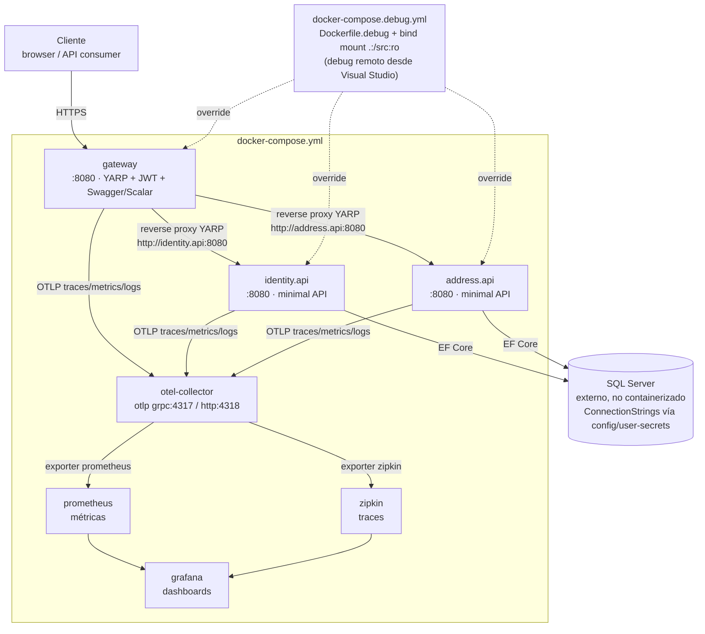

# NetErp

ERP construido como ejercicio de arquitectura de microservicios con .NET. Un
**Gateway** (YARP) enruta a **servicios** independientes, cada uno con Clean
Architecture (Api / Application / Core / Infrastructure), y comparten piezas
transversales a través del proyecto **Commons**.

## Estructura de la solución

```
src/
  Commons/            # librería compartida (no es un servicio)
  Gateway/            # API Gateway (YARP + JWT + OpenAPI aggregation)
  Gateway.Test/       # xUnit + NSubstitute para Gateway (ver seccion de Testing)
  services/
    identity/         # servicio de referencia, implementado end-to-end
      Identity.Api/            (endpoints minimal API, Program.cs, seguridad Kestrel)
      Identity.Application/    (CQRS: Commands/Queries/Handlers/Validators/Dto/Mappers)
      Identity.Core/           (entidades + interfaces de repositorio, sin dependencias externas)
      Identity.Infrastructure/ (EF Core SqlServer, repositorios)
      Identity.Test/           (xUnit + NSubstitute, un test por Handler/Validator/Repository)
    address/          # segundo servicio, implementado pero sin tests/validators — ver nota abajo
      Address.Api/            (endpoints minimal API sobre geografia: paises/ciudades/
                                municipios/localidades/asentamientos/calles/domicilios)
      Address.Application/    (CQRS: Commands/Queries/Handlers/Dto/Mappers — SIN Validators)
      Address.Core/           (entidades + interfaces de repositorio; SI referencia Commons)
      Address.Infrastructure/ (EF Core SqlServer, repositorios)
      # No existe Address.Test todavia
```

`NetErp.slnx` incluye Commons, Gateway, Gateway.Test y los proyectos de
`identity` y `address`. **`address` ya esta implementado** (no es scaffold):
expone `/api/v1/addresses/*` vía Gateway con casos de uso reales (alta de
domicilio, consulta por id, catalogos de pais/ciudad/municipio/localidad/
asentamiento). Le faltan dos cosas que sí tiene `identity` y que hay que
replicar al tocar este servicio:
- **`Address.Test`**: no existe ningún proyecto de tests para `address` — es
  la brecha más grande frente al resto de la solución.
- **Validators**: ningún Command/Query de `Address.Application` tiene su
  `AbstractValidator<T>`; el decorador de validación (ver "Flujo de una
  request" mas abajo) ya está enchufado y correría automáticamente en
  cuanto se agregue uno — hoy simplemente no hay ninguno.

## Arquitectura

### Módulos y dependencias


```mermaid
graph LR
  subgraph Commons["Commons (transversal, sin ser un servicio)"]
    direction TB
    Mediator["Mediator<br/>ICommand/IQuery + Dispatcher"]
    EndPoints["EndPoints<br/>IEndpoint + MapEndpointsFromAssembly"]
    ExcHandlers["ExceptionHandlers<br/>Validation / Unhandled"]
    I18n["I18n<br/>ResxLocalizer"]
    Observability["Observability<br/>Serilog + OpenTelemetry SDK"]
    AppServices["AppServices<br/>DI: Application / Infrastructure / I18n"]
  end

  GwApi["Gateway<br/>YARP + JWT + Swagger/Scalar"]
  GwTest["Gateway.Test"]

  subgraph IdentitySvc["Identity (servicio de referencia)"]
    direction TB
    IdApi["Identity.Api<br/>minimal API endpoints"]
    IdApp["Identity.Application<br/>Commands/Queries/Handlers/Validators"]
    IdCore["Identity.Core<br/>Entities + IUserRepository + Optional&lt;T&gt;<br/>(sin dependencias, ni a Commons)"]
    IdInfra["Identity.Infrastructure<br/>EF Core SqlServer + UserRepository"]
  end
  IdTest["Identity.Test"]

  subgraph AddressSvc["Address (sin tests, sin validators)"]
    direction TB
    AddrApi["Address.Api<br/>minimal API endpoints"]
    AddrApp["Address.Application<br/>Commands/Queries/Handlers<br/>(sin Validators)"]
    AddrCore["Address.Core<br/>Entities + I*Repository<br/>(SI referencia Commons, a diferencia de Identity.Core)"]
    AddrInfra["Address.Infrastructure<br/>EF Core SqlServer + *Repository"]
  end

  GwApi -->|ProjectReference| Commons
  GwTest -->|ProjectReference| GwApi

  IdApi -->|ProjectReference| IdInfra
  IdInfra -->|ProjectReference| IdApp
  IdApp -->|ProjectReference| IdCore
  IdApp -->|ProjectReference| Commons
  IdTest -->|ProjectReference| IdApi
  IdTest -->|ProjectReference| IdInfra

  AddrApi -->|ProjectReference| AddrInfra
  AddrInfra -->|ProjectReference| AddrApp
  AddrApp -->|ProjectReference| AddrCore
  AddrApp -->|ProjectReference| Commons
  AddrCore -->|ProjectReference| Commons

  GwApi -.->|"HTTP proxy YARP<br/>/api/v1/auth/* + JWT"| IdApi
  GwApi -.->|"HTTP proxy YARP<br/>/api/v1/addresses/*"| AddrApi
```

`Identity.Core` es la única capa de dominio sin ninguna referencia de
proyecto (ni siquiera a Commons) — ver la nota de `Optional<T>` más abajo
sobre por qué se mantiene así a propósito. **`Address.Core` rompe ese
patrón**: referencia `Commons.csproj` directamente. Es una inconsistencia
real entre los dos servicios (no una variante intencional documentada) —
tenlo presente antes de asumir que "ningún `*.Core` depende de nada" al
generalizar sobre la solución.

### Infraestructura (docker-compose)


```mermaid
graph TB
  Client["Cliente<br/>browser / API consumer"]

  subgraph Compose["docker-compose.yml"]
    Gateway["gateway<br/>:8080 · YARP + JWT + Swagger/Scalar"]
    IdentityApi["identity.api<br/>:8080 · minimal API"]
    AddressApi["address.api<br/>:8080 · minimal API"]
    Otel["otel-collector<br/>otlp grpc:4317 / http:4318"]
    Zipkin["zipkin<br/>traces"]
    Prometheus["prometheus<br/>métricas"]
    Grafana["grafana<br/>dashboards"]
  end

  SqlServer[("SQL Server<br/>externo, no containerizado<br/>ConnectionStrings vía config/user-secrets")]

  Client -->|HTTPS| Gateway
  Gateway -->|"reverse proxy YARP<br/>http://identity.api:8080"| IdentityApi
  Gateway -->|"reverse proxy YARP<br/>http://address.api:8080"| AddressApi
  IdentityApi -->|EF Core| SqlServer
  AddressApi -->|EF Core| SqlServer

  Gateway -->|OTLP traces/metrics/logs| Otel
  IdentityApi -->|OTLP traces/metrics/logs| Otel
  AddressApi -->|OTLP traces/metrics/logs| Otel
  Otel -->|exporter zipkin| Zipkin
  Otel -->|exporter prometheus| Prometheus
  Prometheus --> Grafana
  Zipkin --> Grafana

  Debug["docker-compose.debug.yml<br/>Dockerfile.debug + bind mount .:/src:ro<br/>(debug remoto desde Visual Studio)"]
  Debug -.->|override| Gateway
  Debug -.->|override| IdentityApi
  Debug -.->|override| AddressApi
```

Los tres contenedores de aplicación (`gateway`, `identity.api`, `address.api`)
exportan **traces + metrics + logs** por OTLP al `otel-collector` (nunca
directo a Zipkin/Prometheus/Grafana, ver sección de Observability más abajo);
el collector reenvía traces a Zipkin y métricas a Prometheus, y Grafana
consume de ambos. No hay contenedor de SQL Server en `docker-compose.yml`:
`Identity.Api` y `Address.Api` esperan `ConnectionStrings` por
configuración/user-secrets contra una instancia externa.

**Deuda conocida en `docker-compose.override.yml`**: el bloque de
`address.api` todavía define `ASPNETCORE_HTTPS_PORTS=8081` (copiado del
scaffold original de Visual Studio) y monta `${APPDATA}/ASP.NET/Https`,
mientras que `identity.api` no define ningún puerto HTTPS. `Address.Api`
fuerza Kestrel a HTTP-only en código (`ConfigureKestrel` → `ListenAnyIP(8080)`
en `Program.cs`), pero esa variable de entorno sigue activa: Kestrel también
lee `ASPNETCORE_HTTPS_PORTS` de forma independiente al `ConfigureKestrel`
explícito y puede intentar abrir un endpoint HTTPS en 8081 igualmente dentro
del contenedor, con el mismo error de certificado de desarrollo que ya se
corrigió para `dotnet run` local (`launchSettings.json`, `Dockerfile`). Si
vas a correr `address.api` vía `docker-compose up` y falla con "Unable to
configure HTTPS endpoint", limpiar ese bloque para que quede igual al de
`identity.api` es la causa más probable.

## Flujo de una request (patrón a replicar en servicios nuevos)

1. **Api/Endpoints**: clases `IEndpoint` (`Commons/EndPoints/IEndpoint.cs`) con
   un método estático `MapEndpoints`. Se descubren y registran automáticamente
   vía reflection con `app.MapEndpointsFromAssembly(assembly)` — no hay que
   registrar cada endpoint a mano en `Program.cs`.
2. El endpoint arma un `ICommand<TResponse>` o `IQuery<TResponse>`
   (`Commons/Mediator/`) y lo pasa a `IDispatcher.SendAsync(...)`.
3. **Mediator propio (no MediatR)**: `Dispatcher` (Commons/Mediator/Dispatcher.cs)
   resuelve el handler por reflection (con caché en `ConcurrentDictionary`) y
   lo invoca. `ICommandHandler<TCommand,TResponse>` / `IQueryHandler<TQuery,TResponse>`
   se auto-registran por assembly scanning en
   `RegistrationOfApplicationServices<TAssemblyMarker>.AddApplication` — no
   hay que registrarlos a mano.
4. **Decoradores automáticos** (vía Scrutor `TryDecorate`, mismo método
   anterior): cada handler queda envuelto por
   `Command/QueryValidationExceptionHandler` (corre los `IValidator<T>` de
   FluentValidation antes del handler y lanza `ValidationException` si falla)
   y `Command/QueryUnhandledExceptionHandler`. Un nuevo Command/Query solo
   necesita su `AbstractValidator<T>` en el mismo assembly para quedar
   validado — no hay que envolver nada manualmente.
5. `ValidationExceptionHandler` (Commons) traduce `ValidationException` /
   `BadHttpRequestException` a 400 vía `app.UseExceptionHandler()` +
   `AddProblemDetails()`.
6. Repositorios de Infrastructure se auto-registran por convención de nombre
   (`RegistrationOfInfrastructureServices<TAssemblyMarker>.RepositoryRegistry`:
   busca clases `*Repository` y las mapea a su interfaz `I*Repository`).

Al agregar un caso de uso nuevo: crear el Command/Query + Handler + (opcional)
Validator en `*.Application`; **no** tocar el registro de DI a mano salvo que
sea un servicio con nombre que no siga la convención `*Repository`/`I*`.

## Transversal (Commons)

- **Observability**: Serilog (consola + OTLP) + OpenTelemetry SDK (traces con
  `AlwaysOnSampler`, sin muestreo). Todo apunta al `otel-collector` de
  `docker-compose.yml`, nunca directo a Zipkin/Prometheus/Grafana.
  `builder.AddObservability(serviceName)` + `app.UseObservability()`.
- **I18n**: `Commons/I18n` — es-MX / en-US, resuelto por querystring
  `?culture=` o header `Accept-Language`. Mensajes en `.resx`
  (`GenericMessages` en Commons, `UserMessages` por servicio) leídos con
  `ResxLocalizer`, no con `IStringLocalizer` inyectado.
- **Kestrel hardening**: `AddKestrelHardening()` / `UseKestrelHardening()`,
  presente en Gateway e Identity.Api. **No** está centralizado en Commons:
  cada uno tiene su propia copia en `<Servicio>/Security/
  KestrelHardeningExtensions.cs` (con sus tests en `Gateway.Test`). Si tocas
  este código en un servicio, revisa si el otro necesita el mismo cambio —
  no hay un solo lugar que actualizar.
- **OpenAPI compartido**: `Commons.AppServices.RegistrationOfOpenApi
  .AddSharedOpenApi(this IServiceCollection)` — llamado desde
  `Identity.Api`/`Address.Api` en vez de `builder.Services.AddOpenApi()`
  directo. Registra un `AddDocumentTransformer` que fija
  `document.Servers = [new() { Url = "/" }]`. Por qué: YARP no reenvía el
  Host header original al servicio de destino por defecto
  (`RequestHeaderOriginalHost=false`), así que el documento OpenAPI que cada
  servicio genera terminaría con un `servers` apuntando al Host interno de
  Docker (p.ej. `identity.api:8080`), inalcanzable desde el navegador que
  sirve Swagger/Scalar (servidos por el Gateway). Un array de `servers`
  vacío tampoco alcanza: el `swagger-client` embebido en Swagger UI no cae
  de vuelta al origen actual de forma confiable y produce "Failed to fetch:
  URL scheme must be http or https". Un servidor relativo explícito ("/") sí
  lo resuelven ambas UI contra el origen del Gateway. Cada `*.Api` sigue
  necesitando su propio `PackageReference` a `Microsoft.AspNetCore.OpenApi`
  (para poder llamar `app.MapOpenApi()`), y su versión debe ser >= la que
  fija `Commons.csproj` o falla la restauración con `NU1605` (package
  downgrade).

## Gateway (YARP)

- Configuración declarativa en `Gateway/appsettings.json`, sección
  `ReverseProxy`: **`Clusters` va primero, `Routes` después** (orden
  deliberado en el archivo, no lo inviertas al agregar rutas nuevas). Un
  cluster por servicio (`identity-cluster` → `http://identity.api:8080/`,
  `address-cluster` → `http://address.api:8080/`).
- **Cada endpoint real se registra como su propia ruta YARP** (`Match.Path` +
  `Match.Methods` exactos), no hay un passthrough tipo `/api/v1/addresses/**`
  que reenvíe cualquier método/ruta al cluster. Al agregar un endpoint nuevo
  en un servicio (`new-endpoint`), agregar también su ruta correspondiente
  en `appsettings.json` — de lo contrario el Gateway responde 404 aunque el
  servicio ya lo exponga. Las rutas de `address` están listadas antes que
  las de `identity` en el archivo (orden por servicio, sin significado
  funcional en YARP — es solo la convención que se siguió al agregarlas).
- **Agregación de OpenAPI**: cada servicio expone su propio documento en
  `/openapi/v1.json` (via `AddSharedOpenApi()` + `app.MapOpenApi()`, solo en
  `Development`). El Gateway lo re-expone bajo un nombre propio con una ruta
  YARP + transform (`identity-openapi`: `/openapi/identity.json` →
  `/openapi/v1.json` en `identity-cluster`; mismo patrón para
  `address-openapi`). `Program.cs` registra un `SwaggerEndpoint` y un
  `AddDocument` por servicio (Identity es `isDefault: true`); si agregas un
  servicio nuevo, replica ambas partes (ruta YARP + registro en Swagger UI
  y Scalar) o su documentación no aparecerá en ninguna UI.
- Scalar muestra un documento a la vez con selector/dropdown (o navegando
  directo a `/scalar/{documentName}`, p.ej. `/scalar/address`); que un
  documento no aparezca "por defecto" al abrir `/scalar` no es un bug, es
  que no es el documento `isDefault: true`.
- `/login`, `/logout` y la protección de `/swagger`/Scalar solo se mapean en
  `Development` (ver Testing más abajo). Fuera de eso, **ninguna ruta de
  `/api/v1/auth/*` o `/api/v1/addresses/*` requiere autorización a nivel del
  Gateway** — solo `/swagger` y Scalar están protegidos con la policy
  `Swagger`. Si el plan es exigir JWT en las rutas de negocio, hoy no hay
  ningún `.RequireAuthorization()` aplicado a esas rutas de YARP; es trabajo
  pendiente, no una omisión de esta nota.

## Seguridad (JWT)

- Identity.Api emite el JWT (HMAC-SHA256, claims `sub`/`email`/`jti` + un
  claim `Role` por rol). El **Gateway** es quien valida el token
  (`Gateway/Security/JwtAuthenticationExtensions.cs`) y protege
  `/swagger` y Scalar con la policy `Swagger` (requiere claim de rol
  `SWAGGER`, que debe coincidir con el `NormalizedName` del rol en Identity).
- Gateway e Identity.Api **comparten el mismo `UserSecretsId`** en dev
  (`e247ba43-7d48-46cb-8a54-02978f226af8`) para compartir `Jwt:SigningKey` vía
  user-secrets — no hardcodear la signing key en `appsettings.json`.
- El Gateway permite el JWT también vía cookie (`netErp_swagger_token`) para
  navegación de swagger/scalar desde el navegador; clientes de API siguen
  recibiendo 401/403 normales (`OnChallenge`/`OnForbidden` distinguen por
  `Accept: text/html`).

## Convenciones de código observadas

- Indentación de **2 espacios**, `Nullable` + `ImplicitUsings` habilitados en
  todos los `.csproj`, target `net10.0`.
- Primary constructors (`class Foo(IDep dep) : IBar`) en handlers y
  repositorios.
- `.ConfigureAwait(false)` en todo `await` de librería/servicio (no en tests).
- DTOs de Application como `record`.
- Comentarios de código en **español**, explicando el *por qué* (decisiones
  de diseño), no el qué.
- Tests: xUnit + NSubstitute, un archivo de test por clase, nombres
  `Method_When<condición>_<resultado esperado>`.

## Testing

- **Identity.Test** (`src/services/identity/Identity.Test`) y **Gateway.Test**
  (`src/Gateway.Test`) son los únicos dos proyectos de test hoy, ambos xUnit +
  NSubstitute + `Microsoft.AspNetCore.Mvc.Testing`/`TestHost`. Naming:
  `<Proyecto>.Test` (no `<Proyecto>Test`), como el resto de la solución.
  **`address` no tiene `Address.Test`** — si vas a agregarlo, replica esta
  convención de naming y el resto de esta sección.
- Para que `WebApplicationFactory<Program>` funcione, cada `*.Api`/Gateway
  `Program.cs` termina con `public partial class Program { }` (top-level
  statements + WebApplicationFactory lo requiere). Si se reescribe un
  `Program.cs`, no borrar esa línea. **`Address.Api/Program.cs` todavía no
  la tiene** (consistente con que no existe `Address.Test` — nadie la
  necesitó todavía): agrégala como parte de crear `Address.Test`, no antes.
- Patrón de test de endpoints (`AuthenticationEndpointsTests`,
  `LoginEndpointsTests`): NO usar `WebApplicationFactory` completo para probar
  un solo `IEndpoint`; construir un `WebApplication.CreateBuilder()` +
  `UseTestServer()` a mano, mapear solo esa clase de endpoint y sustituir sus
  dependencias (`IDispatcher`, `IHttpClientFactory`) con NSubstitute o un
  `HttpMessageHandler` de prueba. Reservar `WebApplicationFactory<Program>`
  para los `ProgramTests` que verifican la composición completa (lectura de
  config, registro de servicios, endpoints mapeados).
- `HttpMessageHandler.SendAsync` es `protected`: NSubstitute no puede
  configurarlo directamente. `Gateway.Test/TestSupport/StubHttpMessageHandler.cs`
  es una subclase de prueba hecha a mano para ese caso puntual (usada para
  simular las respuestas de Identity.Api en `LoginEndpointsTests`); el resto
  de dependencias sustituibles siguen usando NSubstitute.
- Al construir un `WebApplicationBuilder` de prueba con
  `builder.Configuration.Sources.Clear()`, no usar el indexer
  (`builder.Configuration["Key"] = valor`) para inyectar valores después:
  `ConfigurationManager` lanza `InvalidOperationException` ("A configuration
  source is not registered") si no hay ninguna fuente registrada. Usar
  `builder.Configuration.AddInMemoryCollection(new Dictionary<string,string?> {...})`
  en su lugar (o no limpiar `Sources` si el indexer alcanza).
- `HstsMiddleware` (`UseKestrelHardening`) excluye explícitamente
  `localhost`/`127.0.0.1`/`::1`: para probar que agrega el header
  `Strict-Transport-Security` con `TestServer`, el `HttpClient.BaseAddress`
  debe usar un host distinto (p.ej. `https://gateway.tests.local/`), nunca
  `localhost`.
- Los endpoints `/login`, `/logout` y la protección de `/swagger` (Gateway)
  solo se mapean cuando `app.Environment.IsDevelopment()` es verdadero (ver
  `Gateway/Program.cs`). Los `ProgramTests` de Gateway verifican explícitamente
  que en `Production` esos endpoints NO existen — es una prueba de seguridad,
  no un detalle a "corregir" si falla por accidente.

## Cosas a tener presentes / deuda conocida

- `LoginHandler` está modelado como `IQueryHandler` (una consulta) pero
  también escribe (`CreateLogginAttemptAsync`, `IssueRefreshTokenAsync`).
  Es una decisión ya tomada en el proyecto (login "parece" lectura desde el
  endpoint); si tocas ese código, mantén la consistencia en vez de "corregir"
  la pureza CQRS sin que te lo pidan.
- **Resuelto**: `IUserRepository.GetByUserNameAsync` / `GetUserByIdAsync`
  devolvían `new User()` (entidad vacía) como sentinela de "no encontrado".
  Ahora devuelven `Optional<User>` (`Identity.Core/Types/Optional.cs`,
  namespace `Identity.Core.Types`; struct simple con `Some`/`None`/
  `HasValue`/`Value`/`GetValueOrDefault`, sin dependencias). Se agregó a
  `Identity.Core` y no a `Commons` a propósito: `Identity.Core` no tiene
  ninguna referencia de proyecto (ni siquiera a `Commons`) y así se
  mantiene. Si otro servicio necesita el mismo patrón, replica el mismo
  struct en su propio `*.Core` en vez de forzar una referencia a `Commons`
  desde la capa de dominio.
  Efecto colateral (bug fix, no solo refactor): al dejar de ser alcanzable
  el sentinel, `UpdateUserRolesAsync` ahora sí lanza
  `InvalidOperationException` con usuario inexistente (antes era código
  muerto) y `GetUserByIdHandler` ahora sí devuelve el DTO vacío explícito
  (`Email = string.Empty`) en vez de mapear el User vacío (`Email = null`).
- **`AddressRepository.GetAddressByIdAsync` reintrodujo el sentinel que
  Identity ya dejó atrás**: devuelve `entity ?? new()` (`Address.Infrastructure
  /Repositories/AddressRepository.cs`) para "no encontrado", el mismo patrón
  que `IUserRepository` tenía antes de migrar a `Optional<T>` (ver el punto
  "Resuelto" arriba). `Address.Core` ya referencia `Commons` (a diferencia
  de `Identity.Core`), así que si se replica el patrón `Optional<T>` para
  `address`, hay una decisión de diseño real a tomar: copiar el struct en
  `Address.Core` (consistente con la guía "Resuelto" de arriba) o
  aprovechar que `Address.Core` ya depende de `Commons` y mover `Optional<T>`
  ahí como pieza transversal — no asumas una u otra sin preguntarlo.
- **Bug conocido, no corregido**: `AuthenticationEndpoits.cs`, endpoint
  `create-user`, hace `return dispatcher.SendAsync(...).ConfigureAwait(false);`
  dentro de un lambda `async` **sin `await`**. El lambda async termina
  devolviendo un `ConfiguredTaskAwaitable<bool>` como "resultado" en vez de
  `bool`, y minimal API lo serializa tal cual — rompe el JSON de respuesta.
  Failing tests: `Identity.Test.Endpoints.AuthenticationEndpointsTests
  .CreateUser_WhenDispatcherSucceeds_ReturnsOkTrue` y
  `..._WhenDispatcherFails_ReturnsOkFalse`. El fix es reponer el `await`
  (patrón usado en el resto de los handlers de este mismo archivo:
  `login`, `refresh-token`); no se aplicó todavía porque no se pidió como
  parte de una tarea de documentación — confírmalo antes de tocarlo.
- `Address.Api.csproj` conserva `PackageReference
  Include="Grpc.AspNetCore.Server"` sin ningún uso real (no hay `.proto`, ni
  `MapGrpcService`, ni ningún tipo gRPC en el proyecto) — resto de un scaffold
  anterior que usaba Protobuf para el contrato de `Address` y ya no existe.
  Candidato a limpieza si nadie planea agregar gRPC a este servicio.
- `docker-compose.override.yml`: ver la nota de deuda en la sección
  "Infraestructura (docker-compose)" sobre `ASPNETCORE_HTTPS_PORTS=8081`
  todavía presente en el bloque de `address.api`.

## Comandos útiles

```bash
dotnet build NetErp.slnx
dotnet test NetErp.slnx                                             # todos los tests (122 al momento de escribir esto)
dotnet test src/services/identity/Identity.Test/Identity.Test.csproj
dotnet test src/Gateway.Test/Gateway.Test.csproj
docker-compose up            # Gateway + Identity.Api + Address.Api + OTel collector + Zipkin + Prometheus + Grafana
```

No hay `Directory.Build.props` ni `global.json`; cada `.csproj` fija su
propia versión de paquetes.
